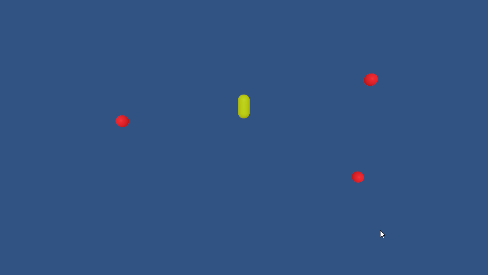

# Wasmball

### Ludum Dare 46 | Submitted: April **2020**

Wasmball is a simple hypercasual game about evading red balls. Player can tap on their touch screen or click on their mouse to make the capsule jump.

This was a Ludum Dare Compo submission, it was built in 48 hours without using any third party assets.

This game uses Unity's new Project Tiny with DOTS under the hood. The game size is remarkably small, less than an MB.

## Links
[Play Online](https://arjunsinh.dev/wasmball/play) | [Ludum Dare Submission](https://ldjam.com/events/ludum-dare/46/wasmball)

## License

This project is licensed under the [MIT License](LICENSE). 